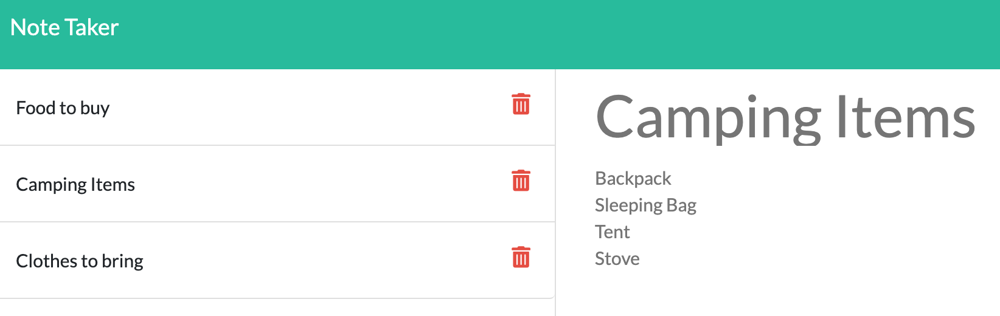

[](https://opensource.org/licenses/MIT)
  # Note Taker

  

  ## Table of Contents
  * [Description](#description)
  * [Installation](#installation)
  * [Usage](#usage)
  * [Contributing](#contributing)
  * [Tests](#tests)
  * [Questions](#questions)
  * [License](#license)

  ## Description
  The note taker site is an application that allows a user to input and save notes. I was primarily responsible for building out the server side of the application. There are two main html pages that are routed to via Express. In addition to rendering html the server also builds an api created with user input. The main api retrieval methods at work are GET, POST, and DELETE, which correspond with displaying notes, adding new notes, and removing notes respectively. The database used to store information is a basic json file that is read and written to. To access the server side api "/api/notes" can be added to the basic url. The format of the stored json is as follows:  
  ```
{
    "error": false,
    "data": [
      {
        "title": "Note title",
        "text": "Note text",
        "id": 1
      }
      ...
    ],
    "message": "information returned"
}
```
  ## Installation
  A package.json is included in the repo with all the basic dependencies used. The Express package handled the server routing. 
  ## Usage
  Here is a link to the deployed site on Heroku:
  
  [Note Taker](https://note-taker-joseph.herokuapp.com/)
  ## Contributing
  Heroku was used to deploy the server side logic and Express handled routing for the site and api. Special thanks to GA Tech bootcamp for the necessary tools and information.
  ## Tests
  N/A
  ## Questions
  Github profile: [dgtlctzn](https://github.com/dgtlctzn)
  
  If you have any questions about the project please contact josephperry720@gmail.com
  ## License
  This project is covered under the MIT license
